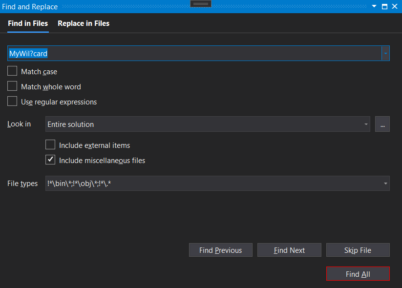

# VS does not allow vsixers to modify its UI. so this vsix do the things in very horrible and ugliest way. It's fragile. It's not safe. Remember it, if you want to compile it and install to your VS.

# WildcardSearch

Visual Studio 2019 searching by wildcards

Red border means the button works in wildcard mode. Regular border means something went wrong and this VSIX is not loaded or experienced a trouble.

Please NOTE: this extension support floating `Find And Replace` window mode ONLY! If this window is docked, I can't intercept `Alt+A` **keyboard** command for an unknown reason. In the floating mode this problem does not exists.
